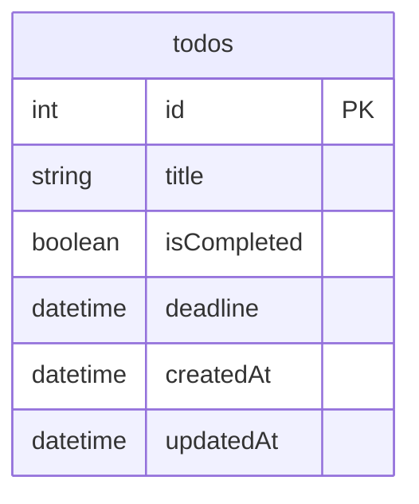

## 概要
本リポジトリはC#・Reactの技術課題として作成した簡易TODOアプリである。   

【アプリURL】   
https://cs-react-todo-dramc7gzhjcmh3dq.japanwest-01.azurewebsites.net/

## 技術スタック

### バックエンド


### フロントエンド


### インフラ


### ツール・その他


## インフラ構成図


## 画面遷移図


## DB設計図


## 苦労した点・工夫した点
- Reactフォルダ構成
  - Railsなどと違いフォルダ構成がかなり柔軟なため、どのように実装していくか迷った。
  - 今回のアプリは機能が単一であること、規模も小さいことから、分かりやすい`type-based`を採用した。
  ```
  src/
  ├── api/                # APIラッパー
  ├── components/         # UIコンポーネント
  ├── pages/              # ページ
  ├── types/              # 型定義
  ```
- 接続先の環境によるDB設定の分岐
  - 開発環境では`SQLite`、本番では`Azure PostgreSQL`を使用するよう`Program.cs`を環境変数に応じて切り替えた。

## 改善したいポイント
- パフォーマンス改善
  - API実行に時間がかかることがあり、少々ストレスがある。
  - `Azure Front Door`の導入や、プランの見直しで改善される？
- UI/UXの改善
  - 各種操作時（特にTODO作成時）に画面変化が少なく、操作が反映されているか不安になる。
  - ローディングスピナーやトーストなどのユーザフィードバックを追加したい。
